
<h1> Лабораторная работа №3 

<h2> Выполнил Кравцов Антон  
<h2> Группа: ИС-23

# Задача 1
Сначала были установлены необходимые зависимости:

sudo apt update  
sudo apt install docker docker-compose-plugin ca-certificates curl gnupg

Далее были добавлен ключ Docker:  
sudo install -m 0755 -d /etc/apt/keyrings  

curl -fsSL https://download.docker.com/linux/debian/gpg | \
  sudo gpg --dearmor -o /etc/apt/keyrings/docker.gpg

sudo chmod a+r /etc/apt/keyrings/docker.gpg

Затем были установлены 'docker' и 'docker-compose-plugin':
sudo apt install docker-ce docker-ce-cli containerd.io docker-buildx-plugin docker-compose-plugin

Произведена регистрация на docker hub

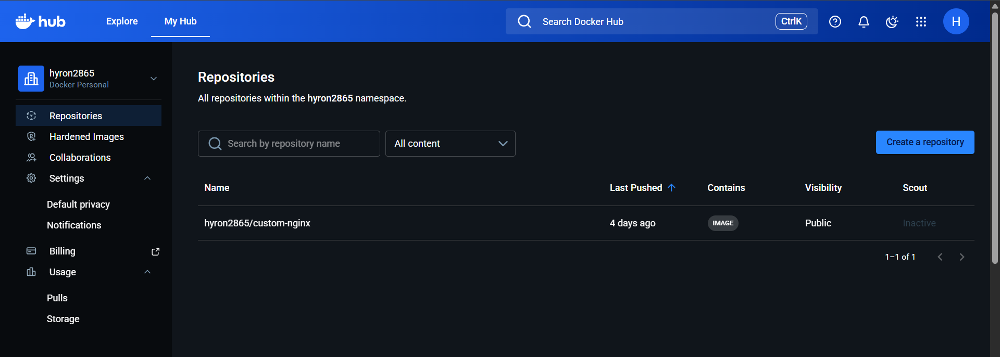

Загружен образ nginx 1.21.1

Создан Dockerfile и произведена замена дефолтной html страницы:  
FROM nginx:alpine  
COPY index.html /usr/share/nginx/html/

Созданный образ собран и отправлен с личный репозиторий docker hub с тегом 1.0.0  
docker tag my-nginx hyron2865/custom-nginx:1.0.0  
docker push hyron2865/custom-nginx:1.0.0

Ссылка на личный репозиторий docker hub: https://hub.docker.com/repository/docker/hyron2865/custom-nginx

# Задача 2
Запускаем ранее созданный образ nginx с особыми требованиями:

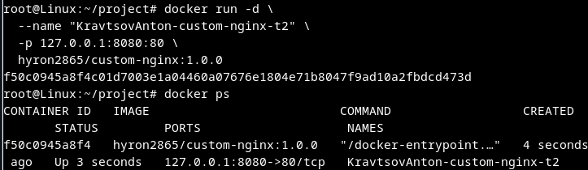

Не отключая контейнер, переименовывем его:

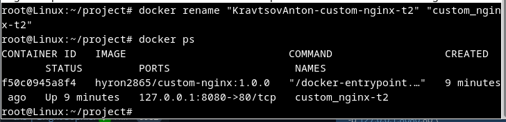

Выполняем предложенную команду:

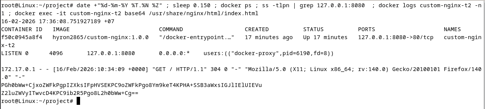

И проверяем доступность индекс страницы через curl:

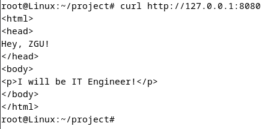

И через браузер:

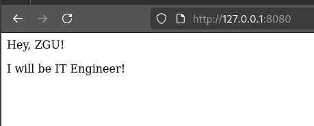

# Задача 3
Подключаемся к стандартному потоку ввода/вывода/ошибок контейнера "custom-nginx-t2" и нажимаем сочетание Ctrl-C:

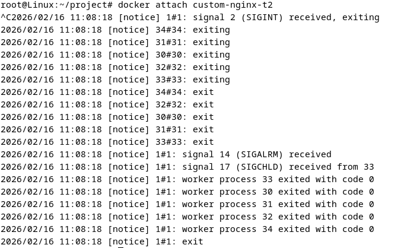

Контейнер остановился:

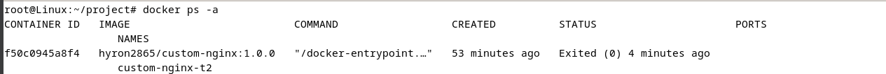

Контейнер остановился, поскольку его главный процесс был завершён отправкой SIGINT этому процессу.

Перезапускаем контейнер:

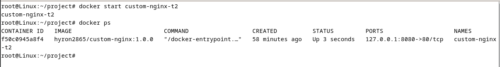

Входим в интерактивный терминал контейнера:  
docker exec -it custom_nginx-t2 /bin/bash

Меняем на listen 81:

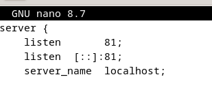

Перезапускаем контейнер и проверяем доступность:

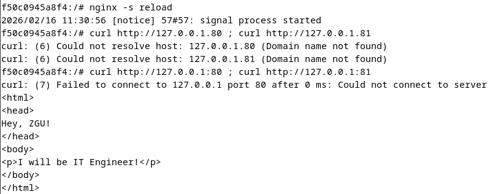

Проверяем вывод предложенных команд:

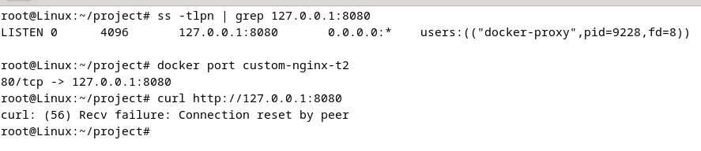

В выводе видим что:
- Docker слушает порт 8080  
- Куда проводится проброс  
- Ошибка подключения при проверке доступности

Суть возникшей проблемы:  
Docker отправляет запросы по порту 80, а nginx внутри контейнера слушает 81, поэтому запросы приходят на непрослушиваемый порт.

Удаляем запущенный контейнер, не останавливая его:

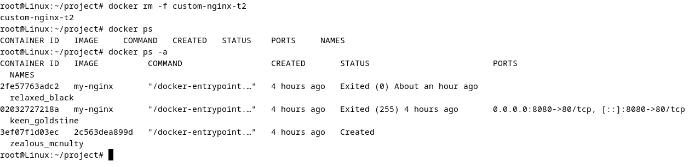

# Задача 4
Запускаем первый контейнер из образа **centos**:

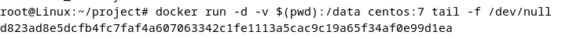

Запускаем второй контейнер из образа **debian**

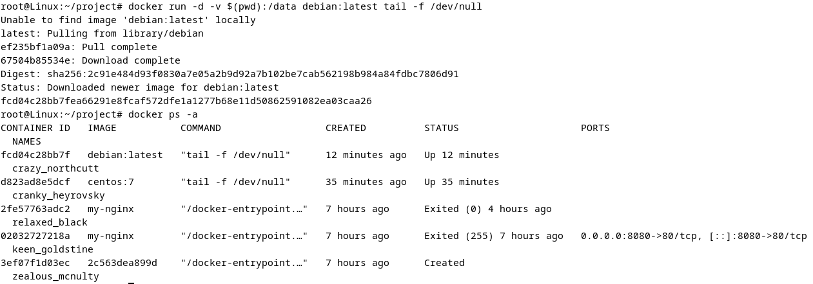

Подключаемся к первому контейнеру и создаём текстовый файл:

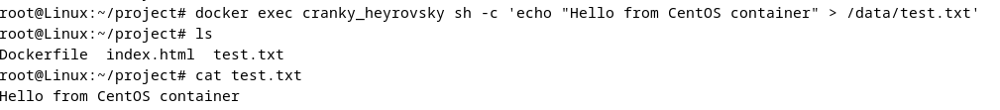

Создаём ещё один файл в этом же каталоге на хосте:

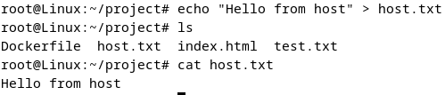

Подключаемся во второй контейнер и отображаем листинг файлов:

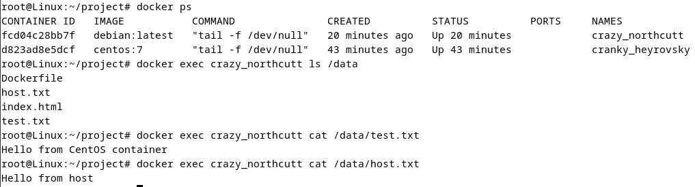

# Задача 5
Создаём отдельную директорию и создаём файлы 'compose.yaml' и 'docker-compose.yaml' и запускаем контейнер:

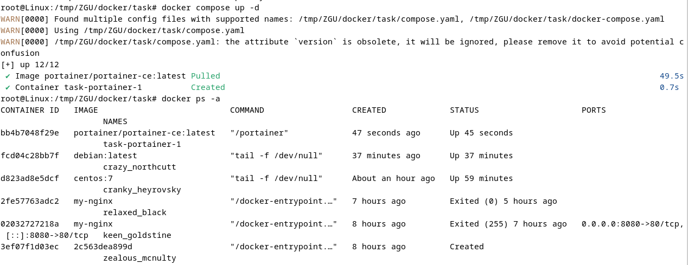

Контейнер запустился по файлу 'compose.yaml'.  
Docker compose выбирает первый файл с поддерживаемым именем в текущей директории, а второй файл игнорирует.

Редактируем 'compose.yaml', чтобы запускались оба файла:

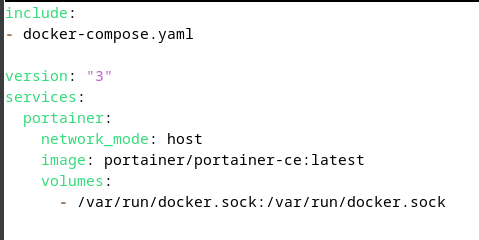

Оба контейнера запустились успешно:

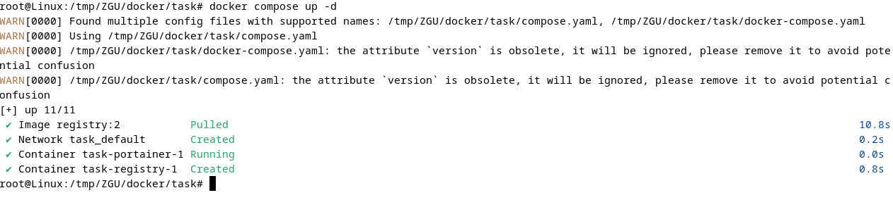

Ставим тег и пушим образ nginx на локальный registry:

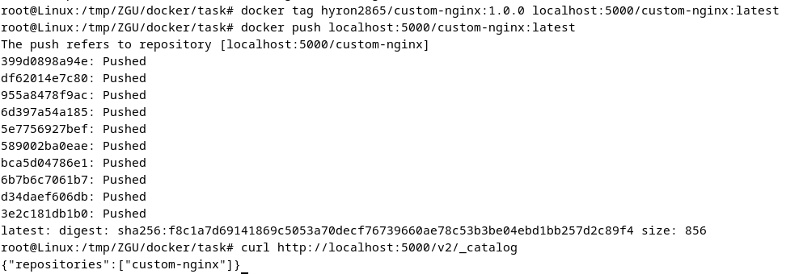

Запускаем http://127.0.0.1:9000 и настраиваем логин и пароль админа

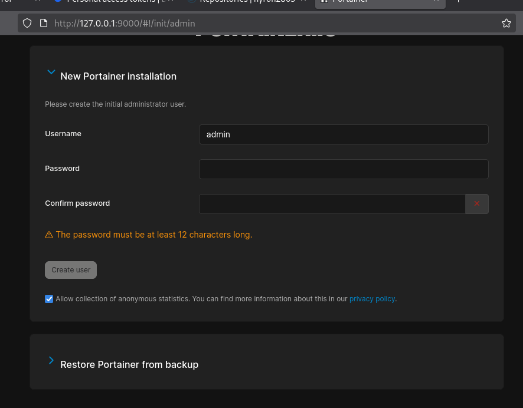

Попадаем в основную панель:

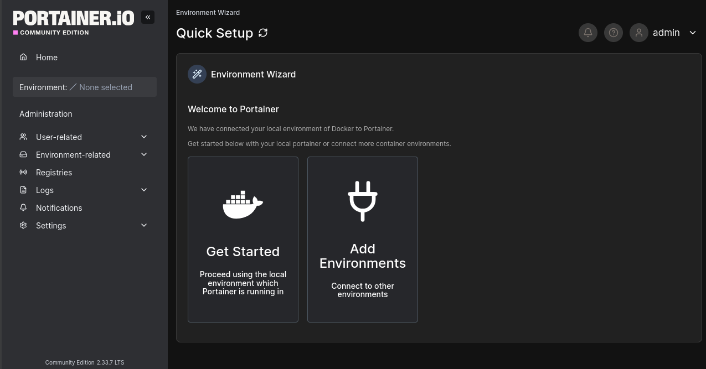

Переходим в локальное окружение -> во вкладку stacks

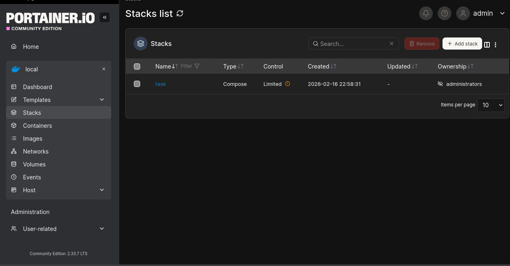

Создаём новый таск  
Выбираем web editor  
И деплоим туда нужный компоуз:  

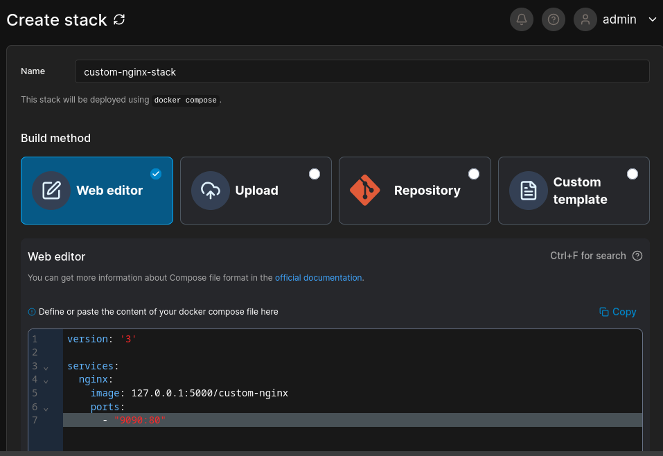

Создался наш стак и теперь по 9090 можно увидеть наш nginx:

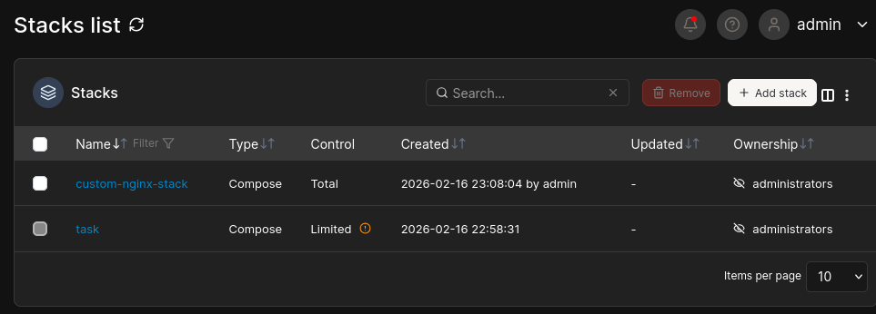

Переходим во вкладку Containers и находим наш контейнер с nginx  
Нажимаем inspect

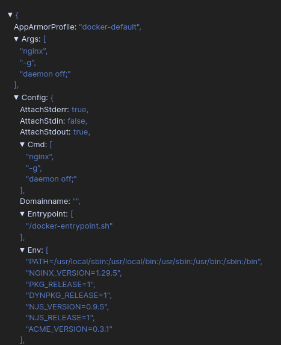
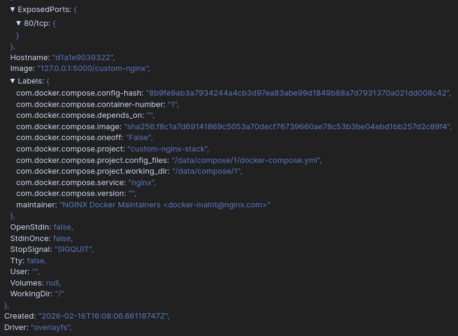

Удаляем compose.yaml:

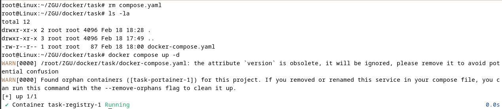

Получаем 2 предупреждения:  
Один говорит о том, что атрибут "версия" больше не требуется и он будет проигнорирован, но его стоит убрать.

Второй говорит про orphan containers (осиротевшие контейнеры).  
Это контейнеры, которые были созданы этим compose-проектом ранее, но больше не описаны в текущем compose-файле.

Docker предлагает удалить такие контейнеры.  
Выполняем предложенное действие:

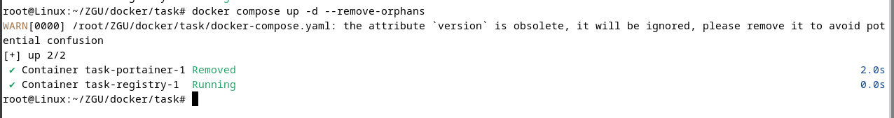

Контейнер пропал:

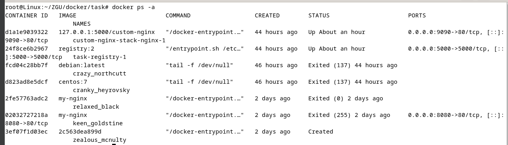

Гасим проект:

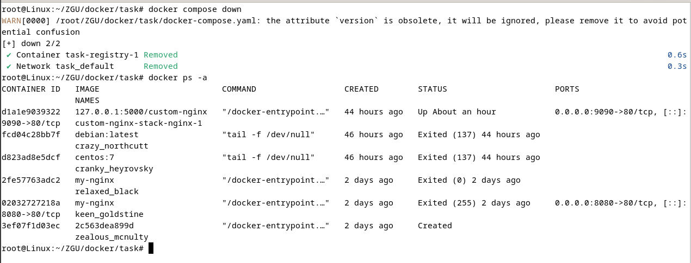

# Задача 6
Создаём пользовательскую сеть 'zgu-net' с типом 'bridge':

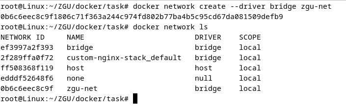

Запускаем два контейнера:

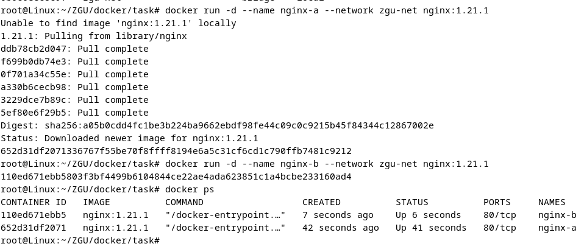

Входим в интерактивный режим контейнера nginx-a и проверяем доступность nginx-b через curl:

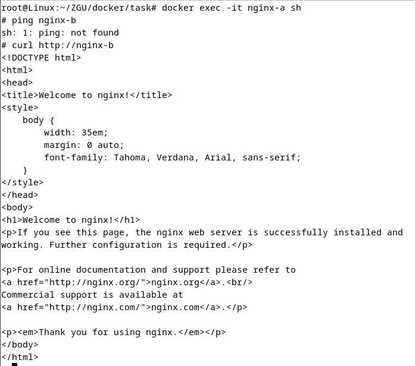

Как видно, контейнер доступен.

Как Docker обеспечивает разрешение имён контейнеров внутри пользовательской сети:  
Docker запускает встроенный DNS-сервер, каждый контейнер регистрируется в сети по своему имени.  
При обращении происходит запрос к встроенному DNS Docker, DNS возвращает IP контейнера и соединение устанавливается по этому IP.

Публикуем порт на хосте:

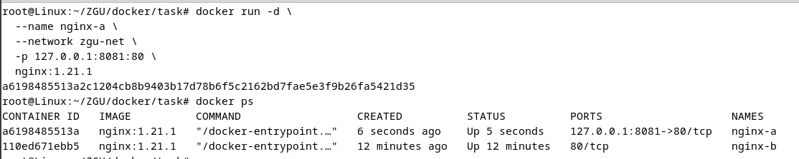

Проверяем доступность:

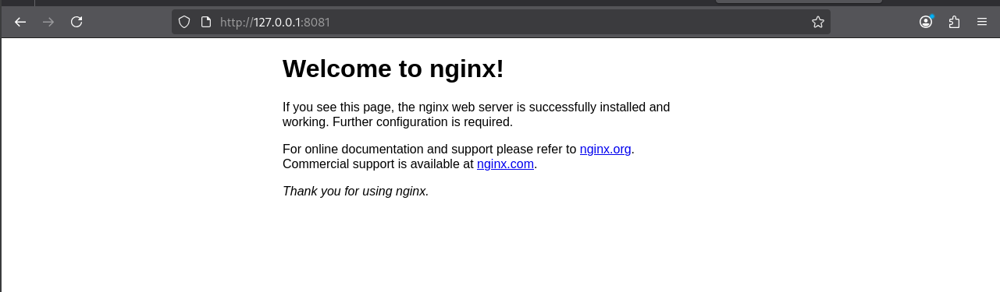

Порт доступен.

Вводим "docker network inspect zgu-net" и находим IP адреса контейнеров:

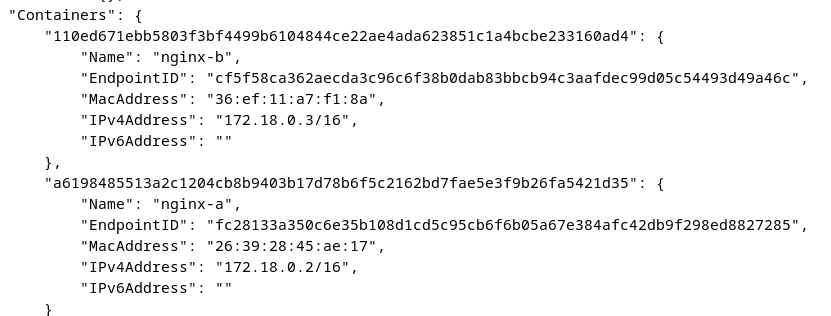

Пользовательская сеть bridge обеспечивает встроенный DNS и удобное взаимодействие контейнеров по именам, тогда как стандартная сеть bridge по умолчанию этого не предоставляет и требует дополнительной настройки.